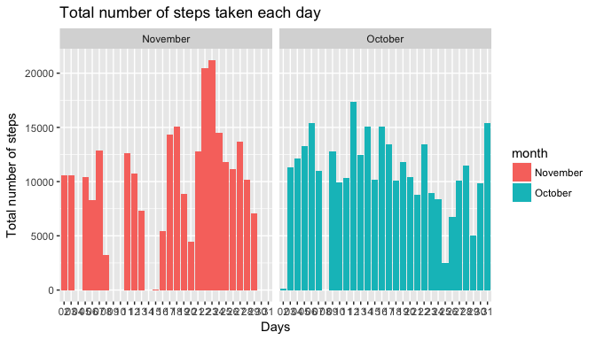
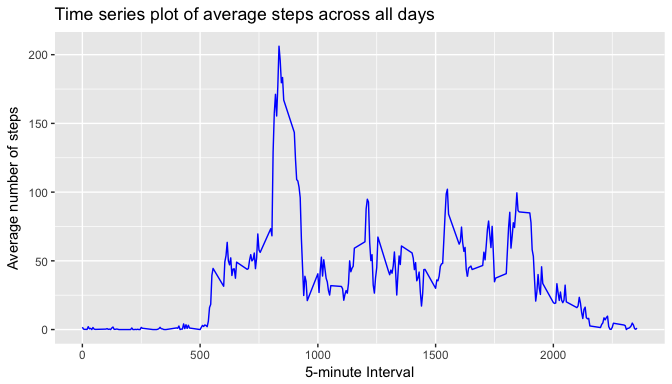
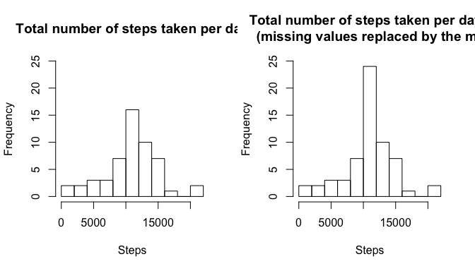
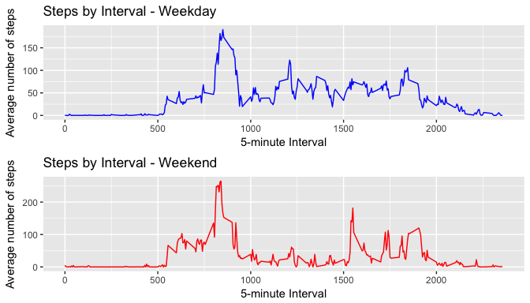

Reproducible Research - Assignment 1
------------------------------------

Rafael Viana de Carvalho

============================================================================================

### Loading necessary libraries

In this code we load all the libraries used in this assignment

``` r
library(knitr)
library(dplyr)
```

    ## 
    ## Attaching package: 'dplyr'

    ## The following objects are masked from 'package:stats':
    ## 
    ##     filter, lag

    ## The following objects are masked from 'package:base':
    ## 
    ##     intersect, setdiff, setequal, union

``` r
library(ggplot2)
library(gridExtra)
```

    ## 
    ## Attaching package: 'gridExtra'

    ## The following object is masked from 'package:dplyr':
    ## 
    ##     combine

Precondition
------------

Download activity.zip file and unzip the **activity.csv** file in the **./data** directory under the current directory. For the first two questions we will need a file that does not contain missing values.

Loading and preprocessing the data
----------------------------------

``` r
# Loading the data and remove the NA values
activity <- read.csv("activity.csv")
notna <- na.exclude(activity)
```

1. What is mean total number of steps taken per day?
----------------------------------------------------

**1.1.** Calculate the total number of steps taken per day

``` r
# Create a Data Set Calculating the total number of steps taken per day
TotalSteps <- aggregate(steps ~ date, notna, sum )

# Process the new Data Set into a format suitable for the analysis
TotalSteps$month <- format(as.Date(TotalSteps[,1]), "%B")
TotalSteps$day <- format(as.Date(TotalSteps[,1]), "%d")
```

**1.2.** Make a histogram of the total number of steps taken each day

``` r
# Plot histogram with frequency of steps by days during the months of October and November, 2012
ggplot(TotalSteps, aes(day, steps, fill = month)) + 
  labs(x="Days", y="Total number of steps", title = "Total number of steps taken each day") + 
  geom_bar(stat = "identity") + facet_grid(.~month)
```



**1.3.** Calculate and report the mean and median of the total number of steps taken per day

``` r
# Calculate the mean of the total number of steps taken per day
paste("Mean Steps per Day =", mean(TotalSteps$steps))
```

    ## [1] "Mean Steps per Day = 10766.1886792453"

``` r
# Calculate the median of the total number of steps taken per day
paste("Median Steps per Day =", median(TotalSteps$steps))
```

    ## [1] "Median Steps per Day = 10765"

2. What is the average daily activity pattern?
----------------------------------------------

**2.1.** Make a time series plot (i.e. 𝚝𝚢𝚙𝚎 = "𝚕") of the 5-minute interval (x-axis) and the average number of steps taken, averaged across all days (y-axis).

``` r
# Create a Data Set Calculating the average number of steps taken per day
AverageSteps <- aggregate(steps ~ interval, notna, mean )
```

``` r
# Time series plot of the 5-minute interval and the average number of steps taken,across all days
ggplot(AverageSteps, aes(interval, steps)) + 
  labs(x="5-minute Interval", y="Average number of steps", title="Time series plot of average steps across all days") + 
  geom_line(stat = "identity", col = "blue")
```



**2.2.** Which 5-minute interval, on average across all the days in the dataset, contains the maximum number of steps?

``` r
# Output the 5-min interval that has max value along with the max value
paste("Interval with max value =", AverageSteps$interval[which(AverageSteps$steps == max(AverageSteps$steps))])
```

    ## [1] "Interval with max value = 835"

``` r
# Output the maximum interval mean steps
paste("Maximum interval mean steps =", max(AverageSteps$steps))
```

    ## [1] "Maximum interval mean steps = 206.169811320755"

3. Imputing missing values
--------------------------

There are a number of days/intervals where there are missing values (coded as 𝙽𝙰). The presence of missing days may introduce bias into some calculations or summaries of the data. In this section the missing values will be considered.

**3.1.** Calculate and report the total number of missing values in the dataset (i.e. the total number of rows with 𝙽𝙰s).

``` r
# Calculate the total of NA values
paste("Total number of missing values =", sum(is.na(activity$steps)))
```

    ## [1] "Total number of missing values = 2304"

**3.2. and 3.3.** Devise a strategy for filling in all of the missing values in the dataset. The strategy does not need to be sophisticated. For example, you could use the mean/median for that day, or the mean for that 5-minute interval, etc. Create a new dataset that is equal to the original dataset but with the missing data filled in.

``` r
# Calculate the average of number of steps without the NAs
AverageSteps<-tapply(notna$steps, notna$interval, mean)

# Create a new dataset and Fill the missing values with average number of steps in the same 5-minute interval
NewActivityDS <- activity
NewActivityDS[which(is.na(NewActivityDS$steps)),1] <- AverageSteps[as.character(NewActivityDS[which(is.na(NewActivityDS$steps)),3])]
```

**3.4.** Make a histogram of the total number of steps taken each day and Calculate and report the mean and median total number of steps taken per day. Do these values differ from the estimates from the first part of the assignment? What is the impact of imputing missing data on the estimates of the total daily number of steps?

``` r
# Calculate the total number of steps taken per day removing the NAs values
TotalSteps <- aggregate(steps ~ date, notna, sum )

# Calculate the Total number of steps considering the NAs replaced by the average number of steps of the 5-min interval
NewTotalSteps <- aggregate(steps ~ date, NewActivityDS, sum )
```

``` r
# Plot a histogram of the total number of steps taken each day comparing the two activity data set
par(mfrow=c(1,2))
hist(TotalSteps$steps,10, main = "Total number of steps taken per day", xlab = "Steps", ylim =c(0, 25))
hist(NewTotalSteps$steps,10, main = "Total number of steps taken per day: 
                        (missing values replaced by the mean of interval)", xlab = "Steps",ylim =c(0, 25))
```



``` r
# Compare the mean to analyse the impct impact of inputting missing data
mean(NewTotalSteps$steps) - mean(TotalSteps$steps)
```

    ## [1] 0

``` r
# Compare the median to analyse the impct impact of inputting missing data
median(NewTotalSteps$steps) - median(TotalSteps$steps)
```

    ## [1] 1.188679

**The impact of inputting missing data is minimal, as only the median seems to be changing but by just over one step.**

4. Are there differences in activity patterns between weekdays and weekends?
----------------------------------------------------------------------------

For this part the 𝚠𝚎𝚎𝚔𝚍𝚊𝚢𝚜() function may be of some help here. Use the dataset with the filled-in missing values for this part.

**4.1.** Create a new factor variable in the dataset with two levels – “weekday” and “weekend” indicating whether a given date is a weekday or weekend day.

``` r
# Create a new factor variable in the dataset with the two levels: “weekday” and “weekend”
notna$weekdayType <- ifelse(weekdays(as.POSIXct.Date(notna$date)) 
                        %in% c("Saturday", "Sunday"), "weekend", "weekday")

# Subset the data set by week and weekend
ActivityWE <- subset(notna, weekdayType == "weekend")
ActivityWD <- subset(notna, weekdayType == "weekday")

# Average the number of steps per interval per weekdays and weekend
AvgWeekend <- aggregate(steps ~ interval, ActivityWE, mean )
AvgWeekday <- aggregate(steps ~ interval, ActivityWD, mean )
```

**4.2.** Make a panel plot containing a time series plot (i.e. 𝚝𝚢𝚙𝚎 = "𝚕") of the 5-minute interval (x-axis) and the average number of steps taken, averaged across all weekday days or weekend days (y-axis).

``` r
# Time series plot of the 5-minute interval and the average number of steps across all weekdays or weekend
plot1 <- ggplot(AvgWeekday, aes(interval, steps)) + labs(x="5-minute Interval", y="Average number of steps", 
              title="Steps by Interval - Weekday") + geom_line(stat = "identity", col = "blue")
plot2 <- ggplot(AvgWeekend, aes(interval, steps)) + labs(x="5-minute Interval", y="Average number of steps", 
              title="Steps by Interval - Weekend") + geom_line(stat = "identity", col = "red")
grid.arrange(plot1, plot2, nrow=2)
```


